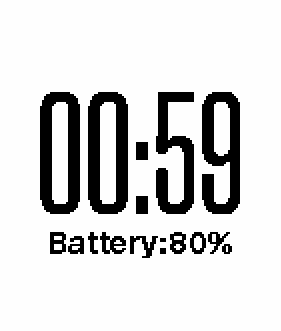

# SiliconSampler
Pebble SDK WatchFace

Started with the [Pebble SDK tutorial](https://developer.getpebble.com/blog/2014/06/10/Pebble-SDK-Tutorial-1/) I'm exploring the Pebble SDK while creating a fun WatchFace.

---
###Fun facts
####To build and run on simulator
Run in the folder, a.k.a Run.sh

	pebble build && pebble install --emulator basalt

####To build and run on device

	pebble build && pebble install --phone=[IP address]

####Debug
Add to the code

	APP_LOG(APP_LOG_LEVEL_DEBUG, "format", format arguments);
	
Run (aka Debug.sh)

	pebble logs --emulator=basalt
	
####Headers
Definitions can be found at (example is for the basalt)

	/Users/[USER_NAME]/Library/Application\ Support/Pebble\ SDK/SDKs/3.8.2/sdk-core/pebble/basalt/include/pebble.h

####Custom font compilation can stuck
Fortunately it is a known issue with a [hacky fix](https://forums.getpebble.com/discussion/30424/pebble-build-stopped-around-building-resources).